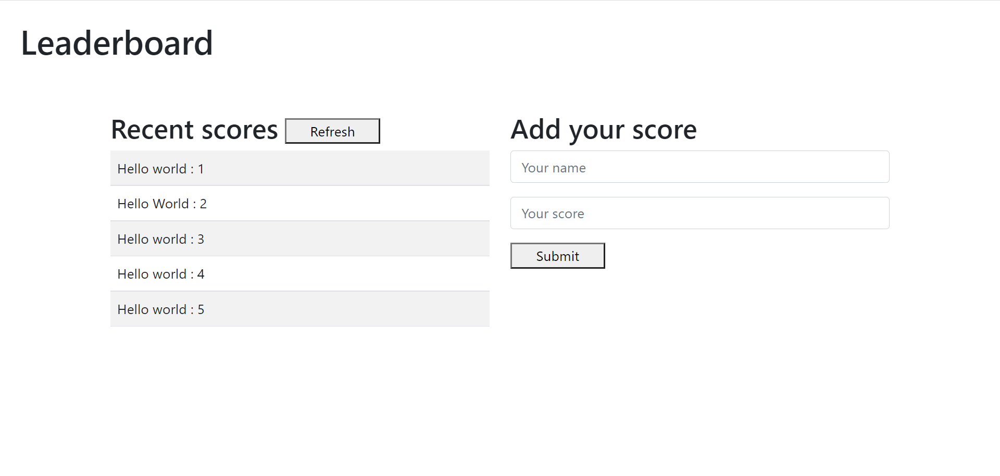

# Leaderboad

The leaderboard website displays scores submitted by different players. It also allows you to submit your score. All data is preserved thanks to the external Leaderboard API service.. It is created with HTML , CSS , JS and webpack, NPM. 

look thorugh the website to see the work and contact me if needed.

## Built With

- HTML and CSS, Javacript , webpack, NPM 
- VS Code, Chrome DevTools

## Getting Started

To get a local copy up and running follow these simple example steps.

### Prerequisites

install VS Code,  Chrome , Node.js and Git Bash 

### Setup

download the repositoyr using git clone.

### Install

cd into the repository folder on your local machine.
use npm i to install dependency packages.
use npm start to see the project in your browser.

### Deployment

run npm start.

### Live Demo
[Live Demo Link](  https://dyaryraoof.github.io/leaderboard/dist)

## Authors

👤 **Dyary Raoof Bayz**

- GitHub: [@DyaryRaoof](https://github.com/DyaryRaoof)
- Twitter: [@DyaryRaoof](https://twitter.com/DyaryRaoof)
- LinkedIn: [@DyaryRaoof](https://linkedin.com/in/DyaryRaoof)

## 🤝 Contributing

Contributions, issues, and feature requests are welcome!

Feel free to check the [issues page](https://github.com/DyaryRaoof/leaderboard/issues).

## Show your support

Give a ⭐️ if you like this project!

## Acknowledgments

- Hat tip to anyone whose code was used
- Inspiration
- etc

## 📝 License

This project is [MIT](./MIT.md) licensed.
